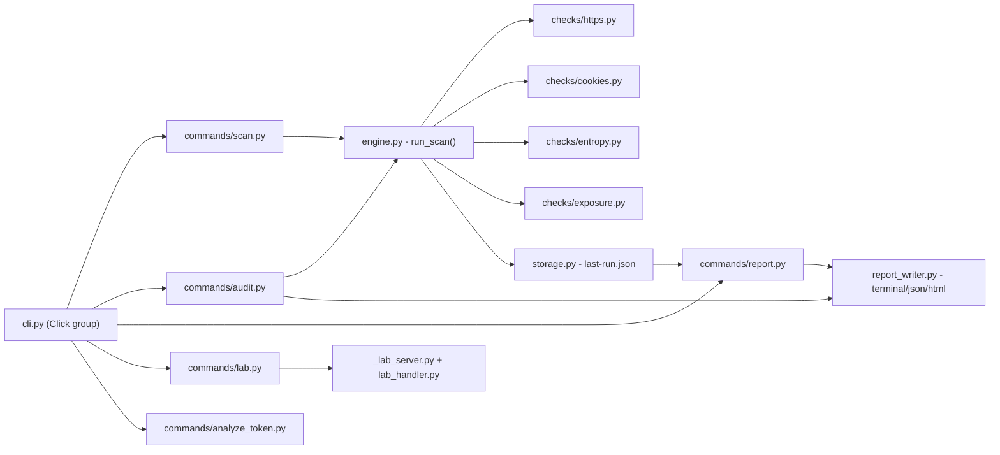

# SessionGuard

A portable CLI tool for auditing session/cookie security — HTTPS/HSTS
enforcement, cookie flags, token entropy, and accidental token/secret
exposure — against systems you own or are explicitly authorized to
test.

Every check is read-only: SessionGuard makes an HTTP GET, reads the
response, and reports what it sees. It never touches a real browser
profile, a real account, or anyone's real session — including in the
`lab` sandbox, which is a local server SessionGuard generates and
controls itself.

## Scope & ethics

- **Authorized targets only.** Point this at systems you own, or have
  explicit written permission to test. `targets.example.yaml` and every
  command's `--help` text say this again for a reason.
- **No credential collection.** SessionGuard never harvests, stores, or
  transmits real session tokens or cookies from any browser or website.
  The `lab` command's "disposable session data" is synthetic — generated
  locally, by SessionGuard, for SessionGuard to scan.
- **Findings are redacted by default.** Any token- or secret-shaped
  value SessionGuard discovers during a scan (see `exposed-*` checks
  below) is masked before it's shown, logged, or saved — you get a
  fingerprint, never the raw value.
- **This is a defensive tool.** Every check answers "is this
  configured safely," never "how do I get in."

## Quickstart

```bash
pip install -e ".[dev]"          # inside a venv, or add --break-system-packages
sessionguard scan https://example.com
sessionguard analyze-token eyJhbGciOi...   # or a path to a file with one
sessionguard version
pytest                            # runs the full test suite
```

Want a safe target to try everything against, with no real account
involved? See [Try it against the lab](#try-it-against-the-lab) below.

## Commands

| Command           | What it does                                                                                   |
|--------------------|--------------------------------------------------------------------------------------------------|
| `scan <url>`        | Runs the full check suite (HTTPS/HSTS, cookies, token entropy, exposure) against one URL       |
| `audit`             | Runs `scan`'s checks against every entry in `targets.yaml`, with `--format terminal\|json\|html` |
| `analyze-token`     | Decodes a JWT's header/payload (no signature check) and flags `alg=none`, missing `exp`, etc.  |
| `report`            | Re-renders the last `scan`/`audit` run in a different format, without re-scanning              |
| `lab`               | Starts/stops a local, synthetic test target for safely exercising every check above            |
| `version`           | Prints the installed version                                                                    |

### What gets checked

| Check                     | Looks for                                                              |
|----------------------------|--------------------------------------------------------------------------|
| `https-enforcement`         | Whether the target is served (or redirects to) HTTPS                    |
| `hsts-header`               | Presence of `Strict-Transport-Security`                                 |
| `cookie-secure-flag`        | Missing `Secure` on an HTTPS cookie                                     |
| `cookie-httponly-flag`      | Missing `HttpOnly` (cookie readable by JavaScript)                      |
| `cookie-samesite`           | Missing `SameSite`, or `SameSite=None` without `Secure`                 |
| `token-entropy`             | Session/auth-looking cookie values that don't look random enough        |
| `token-in-url`               | Session/auth-looking values passed as URL query parameters              |
| `exposed-jwt-in-body`        | A JWT-shaped string embedded in the response body                       |
| `exposed-aws-key-in-body`    | A string matching the AWS Access Key ID format                          |
| `exposed-secret-in-body`     | A string matching a common `api_key` / `secret` / `token` assignment    |
| `exposed-secret-in-headers`  | Any of the above patterns found in a response header value              |

## Try it against the lab

No real website or account needed — `lab` starts a small local server
with a mix of intentionally good and bad cookie configurations:

```bash
sessionguard lab start
sessionguard scan http://127.0.0.1:<port>/insecure
sessionguard lab stop
```

`lab start` prints the exact URL and port. Routes:

| Route            | Demonstrates                                   |
|-------------------|--------------------------------------------------|
| `/`                | A fully-correct cookie — passes every check      |
| `/insecure`        | Cookie missing `Secure` and `HttpOnly`           |
| `/samesite-none`   | `SameSite=None` without `Secure`                 |
| `/leaky-token`     | A fake JWT embedded in the page body             |

Append e.g. `?access_token=demo123` to any route to see `token-in-url`
fire. Optionally preview the page in a real (disposable, throwaway)
browser instance via Playwright:

```bash
pip install ".[lab]" && playwright install
sessionguard lab start --browser chromium   # or firefox / webkit / all
```

This only ever opens a fresh, temporary browser context against
SessionGuard's own local server — it does not read your existing
browser profiles or real cookies.

## Installation options

**From source (any OS with Python 3.9+):**
```bash
pip install -e ".[dev]"
```

**Single-file binary (no Python required):** see
[`packaging/README.md`](packaging/README.md) for building a standalone
Windows/macOS/Linux executable with PyInstaller, or grab one from a
tagged release's GitHub Actions build.

## Architecture



`engine.py` is the single place that knows the full list of checks —
`scan` and `audit` both call `run_scan()`, so the two commands can never
drift out of sync about what actually gets checked.

## Project layout

Every file that ships in the repo — 37 files total, verified against the
actual tree (not a collapsed summary):

```
sessionguard/
├── .github/
│   └── workflows/
│       └── build.yml            # CI: run tests, then build win/mac/linux binaries
├── .gitignore
├── LICENSE
├── README.md
├── pyproject.toml
├── targets.example.yaml           # copy to targets.yaml (gitignored) and fill in real targets
├── packaging/
│   ├── README.md                    # packaging instructions
│   └── build.py                      # PyInstaller build script (run per-OS)
├── src/sessionguard/
│   ├── __init__.py                    # __version__
│   ├── __main__.py                     # `python -m sessionguard`; PyInstaller entry point
│   ├── _lab_server.py                   # standalone entry point, run as a background process
│   ├── cli.py                            # command group, wires everything together
│   ├── engine.py                          # run_scan(): the shared check pipeline
│   ├── lab_handler.py                      # HTTP handler for the synthetic test server
│   ├── models.py                            # Finding / Severity / ScanResult
│   ├── report_writer.py                      # terminal / JSON / HTML rendering
│   ├── storage.py                              # persists the last run for `report`
│   ├── checks/
│   │   ├── __init__.py
│   │   ├── cookies.py                           # Secure / HttpOnly / SameSite / lifetime
│   │   ├── entropy.py                            # session-token randomness heuristic
│   │   ├── exposure.py                            # leaked token/secret detection (redacted)
│   │   └── https.py                                # HTTPS enforcement + HSTS
│   └── commands/
│       ├── __init__.py
│       ├── analyze_token.py
│       ├── audit.py
│       ├── lab.py
│       ├── report.py
│       ├── scan.py
│       └── version_cmd.py
└── tests/
    ├── test_audit.py
    ├── test_cookies.py
    ├── test_entropy.py
    ├── test_exposure.py
    ├── test_https.py
    ├── test_lab_handler.py
    ├── test_report.py
    └── test_storage.py
```

Not shown above because they're not source — `.gitignore` deliberately
excludes them, and they'll appear locally the moment you install/test:
`__pycache__/` (one `.pyc` per imported module) and `sessionguard.egg-info/`
(metadata `pip install -e` generates). If you count files with something
like `find . -type f | wc -l` after running `pip install -e ".[dev]"` and
`pytest`, expect a noticeably higher number than 37 — that's these caches,
not missing project files. `dist/sessionguard` (the built binary) is
similarly a generated artifact, not source — see
[Installation options](#installation-options).

## Development

```bash
pip install -e ".[dev]"
pytest                 # full suite, no network access required
```

Every check module is tested against fake/local response objects — the
suite never makes a real network call, so it runs the same offline as
in CI.

## Possible next steps

- Redirect-chain cookies: only the final response's `Set-Cookie`
  headers are inspected today; cookies set mid-redirect (`response.history`)
  aren't checked yet.
- Historical run tracking (SQLite) instead of only keeping the most
  recent run — useful once `audit` is run on a schedule.
- CLI framework migration to Typer/Rich for richer terminal output —
  the current Click-based CLI was kept because it already works and
  keeps the dependency list minimal; Typer is worth considering if the
  command surface keeps growing.

## License

MIT — see [LICENSE](LICENSE).
